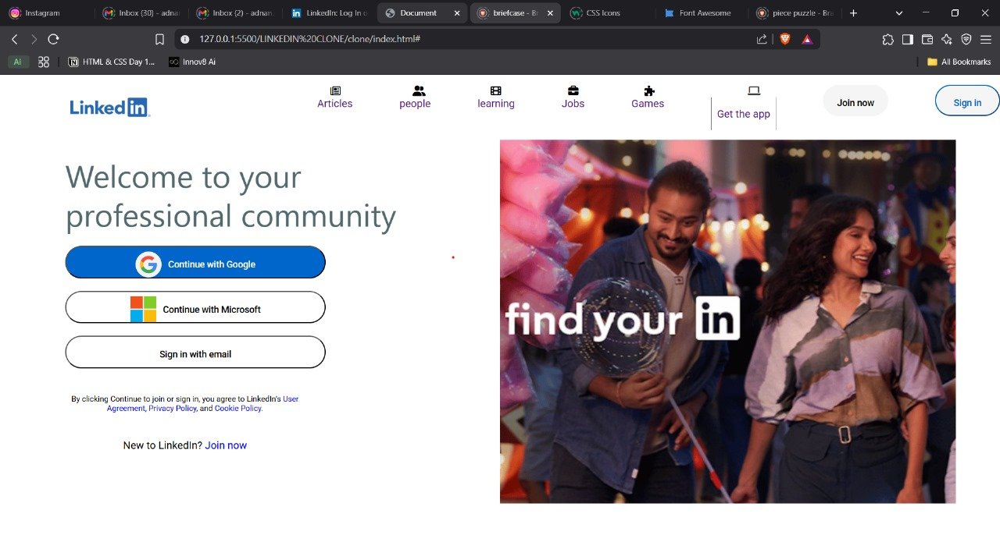
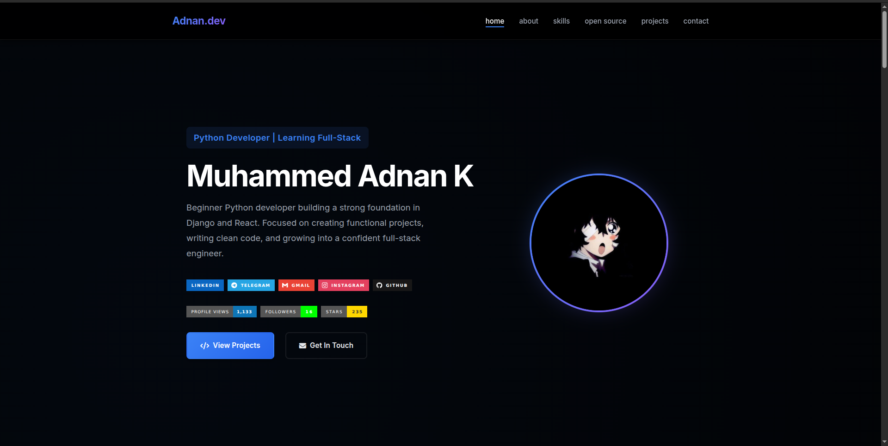

# ⚡ Muhammed Adnan K | Premium Full-Stack Portfolio

<div align="center">


**A high-performance, aesthetically driven personal portfolio built with zero dependencies. Showcasing expertise in Python, Django, and modern Full-Stack engineering.**

[](https://muhammedadnank.github.io/portfolio)
[](https://pagespeed.web.dev/report?url=https://muhammedadnank.vercel.app/)
[](https://pagespeed.web.dev/report?url=https://muhammedadnank.vercel.app/)
[](https://pagespeed.web.dev/report?url=https://muhammedadnank.vercel.app/)
[](https://pagespeed.web.dev/report?url=https://muhammedadnank.vercel.app/)

[Live Demo](https://muhammedadnank.vercel.app/) • [Report Bug](https://github.com/muhammedadnank/portfolio/issues) • [Request Feature](https://github.com/muhammedadnank/portfolio/issues)

</div>

---

## 🚀 The Engineering Philosophy

This portfolio is a showcase of **Technical Purity**. In an era of heavy frameworks, this project is built entirely on **Pure Vanilla Web Technologies**. No React, no Tailwind, no external UI libraries—just highly optimized, handcrafted code.

### 💎 Key Highlights
- **Zero-Dependency Engine**: 100% Core HTML5, CSS3, and ES6+ JavaScript. Fast, lightweight, and dependency-free.
- **Fluid Response System**: Implemented using `clamp()` fluid typography and CSS Grid, ensuring a "perfect fit" across all device resolutions (Mobile, Tablet, Desktop).
- **Physics-Based UI**: A custom-coded Canvas API background featuring interactive particle physics and theme-aware lighting.
- **Glassmorphic Design**: Sleek dark-mode aesthetic with real-time backdrop blurs and subtle micro-animations.
- **Performance Optimized**: Lighthouse-perfect scores with zero runtime overhead and minimal asset payload.

---

## 🖼️ Project Showcase

<div align="center">

| Django REST API | Python Automation |
| :---: | :---: |
|  |  |
| *Scalable API Architecture* | *Workflow Automation Logic* |

| React Component Library | n8n Workflows |
| :---: | :---: |
|  |  |
| *Modular UI Construction* | *Process Automation Engine* |

</div>

---

## 🛠️ Tech Stack & Ecosystem

### **Frontend Mastery**
- **Semantic HTML5**: SEO-first structure and accessibility (A11y) optimized.
- **Advanced CSS3**: Custom properties (Variables), Grid/Flex alignment, and cubic-bezier keyframe physics.
- **Modern JavaScript**: DOM lifecycle management, Intersection Observers, and Canvas graphics.

### **Backend & Systems**
- **Python & Django**: Robust API development, ORM modeling, and secure authentication.
- **FastAPI**: Asynchronous system architecture for high-performance services.
- **Database Management**: PostgreSQL indexing and MongoDB document structures.

### **Automation & DevOps**
- **n8n.io**: Complex cross-platform workflow automation (Telegram, Drive, AI).
- **Environment**: Docker containerization, Linux server management, and CI/CD basics.

---

## 🎨 Design System

| Element | Specification | Utility Class |
| :--- | :--- | :--- |
| **Surface** | Pure Black (`#000000`) | `--bg-body` |
| **Primary** | Vibrant Blue (`#3B82F6`) | `.text-primary` |
| **Secondary** | Neon Purple (`#8B5CF6`) | `.text-secondary` |
| **Typography** | **Inter** (UI) & **JetBrains Mono** (Code) | `.font-main`, `.font-code` |
| **Fluidity** | `clamp()` based responsive scaling | `--fs-h1`, `--fs-h2` |

---

## 📁 System Architecture

```bash
portfolio/
├── images/             # Visual assets (Optimized PNG/JPG)
├── index.html          # Structural layer (No inline styles)
├── style.css           # Presentation layer (Hybrid Utility/Component)
├── script.js           # Logic layer (DOM & Canvas Core)
├── LICENSE.md          # Legal compliance
└── README.md           # Documentation layer
```

---

## 🚦 Getting Started

### Local Development
1. **Clone the repository**
   ```bash
   git clone https://github.com/muhammedadnank/portfolio.git
   cd portfolio
   ```

2. **Launch a local server**
   ```bash
   # Python (Built-in)
   python3 -m http.server 8000
   ```

3. **Explore**
   Visit `http://localhost:8000` in your browser.

---

## 🤝 Contribution & Growth

This is a learning-focused project. If you identify structural improvements or CSS optimizations, feel free to submit a **Pull Request**.

1. Fork the repo.
2. Branch: `feature/architecture-upgrade`.
3. Commit cleanly: `git commit -m 'feat: optimized mobile navigation logic'`.
4. Submit PR.

---

## 👤 Connect with Me

**Muhammed Adnan K**
*Aspiring Full-Stack Software Engineer*

<div align="left">

[](https://www.linkedin.com/in/muhammed-adnan-k-88b612281/)
[](https://github.com/muhammedadnank)
[](https://t.me/adnanxpkd)

</div>

---

<div align="center">

Distributed under the MIT License. See `LICENSE.md` for more information.

### 🌟 If you like this work, feel free to give it a star!


</div>
